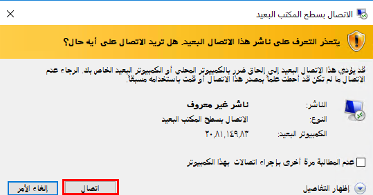
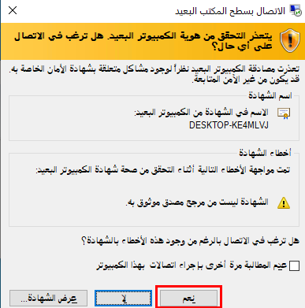
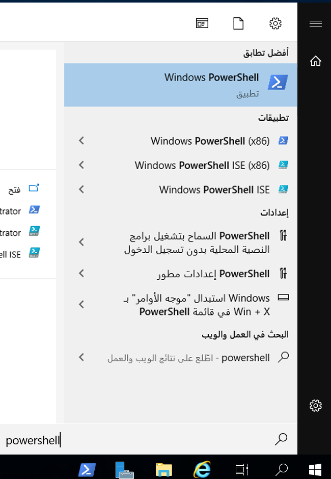

---
wts:
  title: 01 - إنشاء جهاز ظاهري في المدخل (10 دقائق)
  module: Module 02 - Core Azure Services (Workloads)
ms.openlocfilehash: 010d6a19a66f6ac92627720379a4eb850b2ee423
ms.sourcegitcommit: 4a0bfef63f98844f16e2a364d156e96382b8fac5
ms.translationtype: HT
ms.contentlocale: ar-SA
ms.lasthandoff: 05/04/2022
ms.locfileid: "144556864"
---
# <a name="01---create-a-virtual-machine-in-the-portal-10-min"></a>01 - إنشاء جهاز ظاهري في المدخل (10 دقائق)

في هذه المعاينة، سننشئ جهازًا ظاهريًا في مدخل Azure ونتصل بالجهاز الظاهري ونثبت دور خادم الويب ونختبره. 

**ملاحظة**: خذ الوقت الكافي أثناء مطالعة هذا الدليل للنقر فوق الأيقونات المعلوماتية وقراءتها. 

# <a name="task-1-create-the-virtual-machine"></a>المهمة 1: إنشاء الجهاز الظاهري 
1. سجّل الدخول إلى **مدخل Azure https://portal.azure.com**

3. من جزء **جميع الخدمات**، في قائمة المدخل، ابحث عن وحدد **الأجهزة الظاهرية**، ثم انقر فوق **+إنشاء** واختر **+جهاز ظاهري Azure** من القائمة المنسدلة.

4. في علامة تبويب **الأساسيات**، اكتب المعلومات التالية (اترك الإعدادات الافتراضية لكل شيء آخر):

    | الإعدادات | القيم |
    |  -- | -- |
    | الاشتراك | **استخدام الإعدادات الافتراضية المقدمة** |
    | مجموعة الموارد | **إنشاء مجموعة موارد جديدة** |
    | اسم الجهاز الظاهري | **myVM** |
    | المنطقة | **(US) East US**|
    | خيارات التوفر | لا توجد خيارات تكرار للبنية الأساسية مطلوبة|
    | صورة | **Windows Server 2019 Datacenter - Gen2**|
    | الحجم | **Standard D2s v3**|
    | اسم مستخدم حساب المسؤول | **azureuser** |
    | كلمة مرور حساب المسؤول (اكتبها بحرص!) | **Pa$$w0rd1234**|
    | قواعد منفذ الوارد - | **السماح بمنافذ محددة **|
    | تحديد المنافذ الواردة | **RDP (3389)** و **HTTP (80)**| 

5. قم بالتبديل إلى علامة التبويب "الشبكات" للتأكد من تحديد **HTTP (80) وRDP (3389)** في القسم **تحديد منافذ الوارد**.

6. قم بالتبديل إلى علامة تبويب الإدارة، وفي قسم **المراقبة** ضمنها، حدد الإعداد التالي:

    | الإعدادات | القيم |
    | -- | -- |
    | تشخيص التمهيد | **تعطيل**|

7. اترك الإعدادات المتبقية على قيمها الافتراضية ثم انقر فوق زر **مراجعة + إنشاء** في أسفل الصفحة.

8. بمجرد اجتياز التحقق من الصحة، انقر فوق زر **إنشاء**. يمكن أن يستغرق توزيع الجهاز الظاهري ما بين خمس إلى سبع دقائق.

9. ستتلقى تحديثات على صفحة التوزيع وعبر منطقة **الإعلامات** (أيقونة الجرس في شريط القائمة العلوي).

# <a name="task-2-connect-to-the-virtual-machine"></a>المهمة 2: الاتصال بالجهاز الظاهري

في هذه المهمة، سنتصل بجهازنا الظاهري الجديد باستخدام RDP (بروتوكول سطح المكتب البعيد). 

1. انقر فوق رمز الجرس من شريط الأدوات العلوي الأزرق، وحدد "الانتقال إلى المورد" بعد نجاح عملية التوزيع. 

    **ملاحظة**: يمكنك أيضًا استخدام ارتباط **الانتقال إلى المورد** في صفحة التوزيع. 

2. في نافذة **نظرة عامة** على الجهاز الظاهري، انقر فوق زر **اتصال** واختر **RDP** من القائمة المنبثقة.

    

    **ملاحظة**: تخبرك الإرشادات التالية بكيفية الاتصال بجهازك الظاهري من جهاز كمبيوتر يعمل بنظام Windows. على جهاز Mac، تحتاج إلى عميل RDP مثل عميل سطح المكتب البعيد هذا من متجر Mac App Store وعلى جهاز كمبيوتر يعمل بنظام تشغيل Linux، يمكنك استخدام عميل RDP مفتوح المصدر.

2. في صفحة **الاتصال بالجهاز الظاهري**، احتفظ بالخيارات الافتراضية للاتصال بعنوان IP العام عبر المنفذ 3389 وانقر فوق **تنزيل ملف RDP**. سيتم تنزيل ملف في الجزء السفلي الأيسر من الشاشة.

3. **افتح** ملف RDP الذي تم تنزيله (الموجود في الجزء السفلي الأيسر من جهاز المعمل خاصتك) وانقر فوق **اتصال** عندما يُطلب منك ذلك. 

    

4. في نافذة **أمان Windows**، قم بتسجيل الدخول باستخدام بيانات اعتماد المسؤول التي استخدمتها عند إنشاء **azureuser** لجهازك الظاهري وكلمة المرور **Pa$$w0rd1234**. 

5. قد تتلقى شهادة تحذير أثناء عملية تسجيل الدخول. انقر فوق **نعم** أو لإنشاء الاتصال والاتصال بالجهاز الظاهري الموزَع. ينبغي لك الاتصال بنجاح.

    

سيتم إطلاق جهاز افتراضي جديد (myVM) داخل نشاطك المعملي. أغلق "مدير الخادم" ونوافذ لوحة المعلومات المنبثقة (انقر فوق "x" في الزاوية العلوية اليمنى). من المفترض أن ترى الخلفية الزرقاء لجهازك الظاهري. **تهانينا!** لقد قمت بنشر والاتصال بجهاز ظاهري يعمل بنظام Windows Server. 

# <a name="task-3-install-the-web-server-role-and-test"></a>المهمة 3: تثبيت دور خادم الويب واختباره

في هذه المهمة، ثبّت دور خادم الويب على الخادم بالجهاز الظاهري الذي أنشأته للتو وتأكد من عرض صفحة ترحيب خدمات معلومات الإنترنت الافتراضية. 

1. في الجهاز الظاهري الذي تم فتحه حديثًا، قم بتشغيل PowerShell بالبحث عن **PowerShell** في شريط البحث، وعند العثور عليه، انقر بزر الماوس الأيمن فوق **Windows PowerShell** **للتشغيل كمسؤول**.

    

2. في PowerShell، ثبّت ميزة **خادم الويب** في الجهاز الظاهري عن طريق تشغيل الأمر التالي. (الصق الأمر واضغط على ENTER لبدء عملية التثبيت).

    ```PowerShell
    Install-WindowsFeature -name Web-Server -IncludeManagementTools
    ```
  
3. عند الانتهاء، سيكون هناك مطالبة تفيد **تمت العملية بنجاح** بقيمة **صواب**. لا تحتاج إلى إعادة تشغيل الجهاز الظاهري لإكمال التثبيت. أغلق اتصال RDP بالجهاز الظاهري بالنقر فوق **x** على الشريط الأزرق في منتصف الجزء العلوي من جهازك الظاهري. يمكنك أيضًا تصغيره بالنقر فوق **-** على الشريط الأزرق في منتصف الجزء العلوي.

    

4. بالعودة إلى المدخل، انتقل مرة أخرى إلى نافذة **نظرة عامة** من myVM، واستخدام زر **انقر فوق الحافظة** لنسخ عنوان IP العام في myVM، وافتح علامة تبويب جديدة في المستعرض والصق عنوان IP العام في مربع نص URL واضغط على مفتاح **إدخال** لاستعراضه.

    

5. سيتم عرض صفحة الترحيب الافتراضية لخادم ويب خدمات معلومات الإنترنت.

    

**تهانينا!** لقد أنشأتَ جهاز افتراضي جديد يعمل على خادم ويب يمكن الوصول إليه عبر عنوان IP العام الخاص به. إذا كان لديك تطبيق ويب لاستضافته، فيمكنك توزيع ملفات التطبيق على الجهاز الظاهري واستضافتها للوصول العام على الجهاز الظاهري الموزَع.


**ملاحظة**: لتجنب التكاليف الإضافية، يمكنك اختياريًا إزالة مجموعة الموارد هذه. ابحث عن مجموعات الموارد، وانقر فوق مجموعة الموارد الخاصة بك، ثم انقر فوق **حذف مجموعة الموارد**. تحقق من اسم مجموعة الموارد ثم انقر فوق **حذف**. راقب **الإعلامات** للتحقق من اكتمال الحذف بنجاح. 
