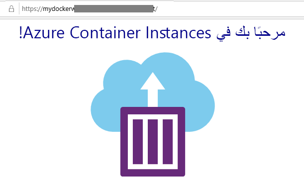

---
wts:
  title: 02 - إنشاء تطبيق ويب (10 دقائق)
  module: Module 02 - Core Azure Services (Workloads)
ms.openlocfilehash: 7b7acc368eff3c653579d54a12828e02a615a672
ms.sourcegitcommit: 26c283fffdd08057fdce65fa29de218fff21c7d0
ms.translationtype: HT
ms.contentlocale: ar-SA
ms.lasthandoff: 01/27/2022
ms.locfileid: "137907289"
---
# 02 - إنشاء تطبيق ويب (10 دقائق)

في هذه المعاينة، سننشئ تطبيق ويب يشغِّل حاوية Docker. تتضمن حاوية Docker رسالة ترحيب. 

خدمة تطبيق Azure عبارة عن مجموعة من أربع خدمات، صُممت جميعًا لمساعدتك على استضافة تطبيقات الويب وتشغيلها. تبدو الخدمات الأربع (تطبيقات الويب وتطبيقات الأجهزة المحمولة وتطبيقات واجهة برمجة التطبيقات وتطبيقات المنطق) مختلفة، ولكنها في النهاية تعمل جميعًا بطرق متشابهة جدًا. تطبيقات الويب هي الأكثر استخدامًا من بين الخدمات الأربع، وهذه هي الخدمة التي سنستخدمها في هذا المعمل.

# المهمة 1: إنشاء تطبيق ويب 

في هذه المهمة، ستنشئ تطبيق ويب خدمة تطبيق Azure. 

1. سجّل الدخول إلى [بوابة Azure](http://portal.azure.com/). 

2. من نافذة **جميع الخدمات**، ابحث عن **خدمات التطبيقات** وحددها، ثم انقر فوق **+إضافة، +إنشاء، +جديد**.

3. في علامة تبويب **الأساسيات** من نافذة **خدمات التطبيقات**، حدد الإعدادات التالية (استبدل **xxxx** في اسم تطبيق الويب بأحرف وأرقام بحيث يكون الاسم فريدًا بشكل عام). اترك الإعدادات الافتراضية لكل شيء آخر، بما في ذلك خطة خدمة التطبيق. 

    | إعداد | القيمة |
    | -- | -- |
    | الاشتراك | **استخدام الإعداد الافتراضي المقدم** |
    | مجموعة الموارد | **إنشاء مجموعة موارد جديدة**|
    | الاسم | **myDockerWebAppxxxx** |
    | نشر | **Docker Container** |
    | نظام تشغيل | **Linux** |
    | المنطقة | **شرق الولايات المتحدة** |
    
    **ملاحظة:** تذكر تغيير **xxxx** بحيث يكون اسم تطبيق الويب الخاص بك فريدًا.

4. انقر فوق **التالي > Docker** وكوّن معلومات الحاوية.  

    | إعداد | القيمة |
    | -- | -- |
    | الخيارات | **حاوية واحدة** |
    | مصدر الصورة | **Docker Hub** |
    | نوع الوصول | **عام** |
    | الصورة والعلامة | **mcr.microsoft.com/azuredocs/aci-helloworld** |
    
 **ملاحظة:** يُعد أمر بدء التشغيل اختياريًا وغير ضروري في هذا التمرين.

5. انقر فوق **مراجعة + إنشاء**، ثم انقر فوق **إنشاء**. 

# المهمة 2: اختبار تطبيق الويب

في هذه المهمة، سنختبر تطبيق الويب.

1. انتظر لحين توزيع تطبيق الويب.

2. من **الإعلامات،** انقر فوق **الانتقال إلى المورد**. 

3. في نافذة **نظرة عامة**، حدد موقع عنوان **URL.** انسخ عنوان URL إلى الحافظة.

    

4. في نافذة مستعرض جديدة، الصق عنوان URl واضغط على "إدخال". مقدمة إلى Azure Container Instances! سيتم عرض رسالة ترحيب.

    

5. ارجع مرة أخرى إلى نافذة **نظرة عامة** من تطبيق الويب الخاص بك ومرر لأسفل. ستلاحظ العديد من الرسوم البيانية التي تتبع البيانات الواردة/الصادرة والطلبات. إذا كررت الخطوة 4 عدة مرات، فينبغي أن تتمكن من رؤية بيانات تتبع الاستخدام المقابلة المعروضة في هذه المخططات. يتضمن هذا عدد الطلبات ومتوسط وقت الاستجابة. 

**ملاحظة**: لتجنب التكاليف الإضافية، يمكنك اختياريًا إزالة مجموعة الموارد هذه. ابحث عن مجموعات الموارد، وانقر فوق مجموعة الموارد الخاصة بك، ثم انقر فوق **حذف مجموعة الموارد**. تحقق من اسم مجموعة الموارد ثم انقر فوق **حذف**. راقب **الإعلامات** لترى كيف تجري عملية الحذف.

تهانينا، لقد نجحت في إنشاء خدمة تطبيقات Azure.
