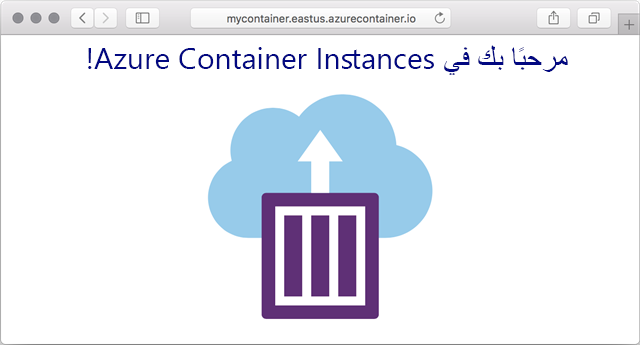

---
wts:
  title: 03 - توزيع مثيلات حاوية Azure (10 دقائق)
  module: Module 02 - Core Azure Services (Workloads)
ms.openlocfilehash: 0616be96840b14f7580c7d2b16cb43b211c6e3a2
ms.sourcegitcommit: 26c283fffdd08057fdce65fa29de218fff21c7d0
ms.translationtype: HT
ms.contentlocale: ar-SA
ms.lasthandoff: 01/27/2022
ms.locfileid: "137907286"
---
# 03 - توزيع مثيلات حاوية Azure (10 دقائق)

في هذه المعاينة، نُنشئ حاوية ونكوّنها ونوزعها باستخدام مثيلات حاوية Azure (ACI) في مدخل Azure. الحاوية عبارة عن تطبيق ويب مثيلات حاوية Azure يعرض صفحة HTML ثابتة. 

# المهمة 1: إنشاء مثيل حاوية 

في هذه المهمة، سننشئ مثيل حاوية جديد لتطبيق الويب.  

1. سجل الدخول إلى [مدخل Azure](https://portal.azure.com).

2. من نافذة **جميع الخدمات**، ابحث عن **مثيلات الحاوية** وحددها، ثم انقر فوق **+إضافة، +إنشاء، +جديد**. 

3. قدّم التفاصيل الأساسية التالية لمثيل الحاوية الجديد (اترك القيم الافتراضية لكل شيء آخر)): 

    | إعداد| القيمة|
    |----|----|
    | الاشتراك | ***استخدام الإعدادات الافتراضية المقدمة*** |
    | مجموعة الموارد | **إنشاء مجموعة موارد جديدة** |
    | اسم الحاوية| **mycontainer**|
    | المنطقة | **(US) East US** |
    | مصدر الصورة| **مركز Docker أو السجل الآخر**|
    | نوع الصورة| **عام**|
    | صورة| **mcr.microsoft.com/azuredocs/aci-helloworld**|
    | نوع نظام التشغيل| **Linux** |
    | الحجم| ***ترك الإعدادات الافتراضية***|

4. كوّن علامة تبويب "الشبكة" (استبدل **xxxxx** بأحرف وأرقام بحيث يكون الاسم فريدًا بشكلٍ عام). اترك جميع الإعدادات الأخرى في قيمها الافتراضية.

    | إعداد| القيمة|
    |--|--|
    | تسمية اسم DNS| **mycontainerdnsxxxxx** |

    
    **ملاحظة**: يمكن الوصول إلى حاويتك بشكلٍ عام على dns-name-label.region.azurecontainer.io. إذا تلقيت رسالة خطأ **تسمية اسم DNS غير متوفرة** بعد التوزيع، فحدد تسمية اسم DNS مختلفة (بدلًا من xxxxx) وأعد التوزيع. 

5. انقر فوق **مراجعة وإنشاء** لبدء عملية التحقق التلقائي.

6. انقر فوق **إنشاء** لإنشاء مثيل الحاوية. 

7. راقب صفحة التوزيع وصفحة **الإعلامات**. 

# المهمة 2: التحقق من توزيع مثيل الحاوية

في هذه المهمة، نتحقق من تشغيل مثيل الحاوية عن طريق التأكد من عرض صفحة الترحيب.

1. بعد اكتمال التوزيع، انقر فوق ارتباط **الانتقال إلى المورد** في نافذة التوزيع أو ارتباط المورد في منطقة الإعلامات.

2. في نافذة **نظرة عامة** في **mycontainer**، تأكد من أن **حالة** حاويتك **قيد التشغيل**. 

3. حدد موقع اسم مجال مؤهل بالكامل (FQDN).

    

2. انسخ FQDN الخاص بالحاوية في علامة تبويب مستعرض ويب جديدة، واضغط على **إدخال**. ينبغي عرض صفحة الترحيب. 

    

**تهانينا!** لقد استخدمت مدخل Azure لتوزيع تطبيق بنجاح في حاوية في مثيلات حاوية Azure.

**ملاحظة**: لتجنب التكاليف الإضافية، يمكنك اختياريًا إزالة مجموعة الموارد هذه. ابحث عن مجموعات الموارد، وانقر فوق مجموعة الموارد الخاصة بك، ثم انقر فوق **حذف مجموعة الموارد**. تحقق من اسم مجموعة الموارد ثم انقر فوق **حذف**. راقب **الإعلامات** لترى كيف تجري عملية الحذف.
