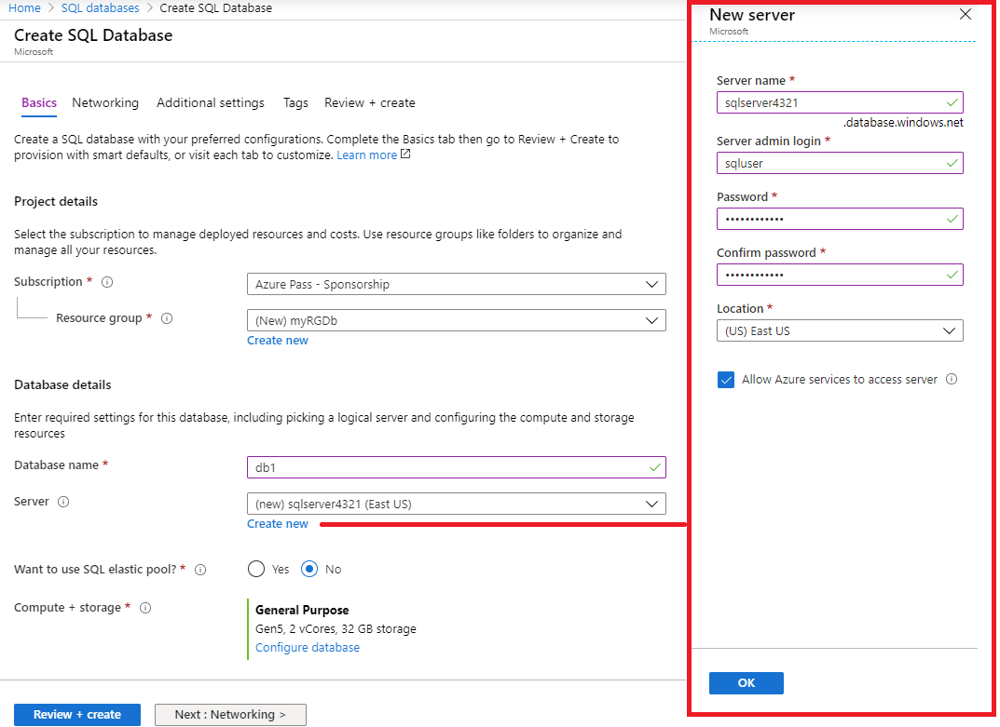
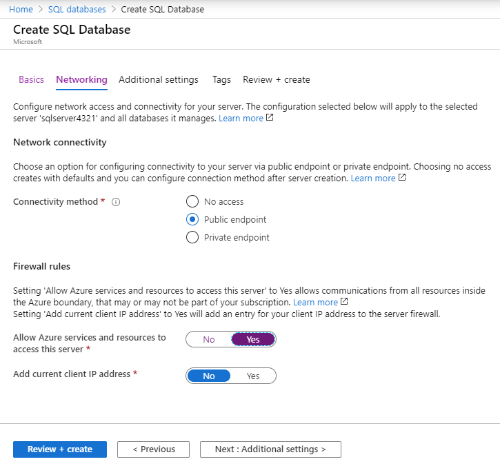
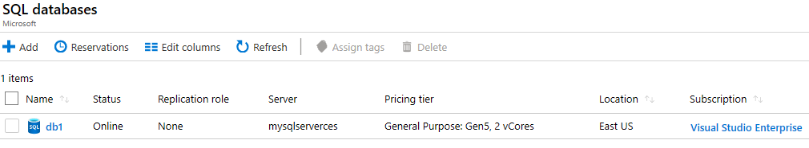

---
wts:
  title: 06 - إنشاء قاعدة بيانات SQL (5 دقائق)
  module: Module 02 - Core Azure Services (Workloads)
ms.openlocfilehash: 61a0e7c7b54ed7cd13a9eae427a5b41abc51cffe
ms.sourcegitcommit: 26c283fffdd08057fdce65fa29de218fff21c7d0
ms.translationtype: HT
ms.contentlocale: ar-SA
ms.lasthandoff: 01/27/2022
ms.locfileid: "137907285"
---
# <a name="06---create-a-sql-database-5-min"></a>06 - إنشاء قاعدة بيانات SQL (5 دقائق)

في هذه المعاينة، سننشئ قاعدة بيانات SQL في Azure ثم نستعلم عن البيانات الموجودة في قاعدة البيانات هذه.

# <a name="task-1-create-the-database"></a>المهمة 1: إنشاء قاعدة البيانات 

في هذه المهمة، سننشئ قاعدة بيانات SQL بناءً على قاعدة بيانات عينة AdventureWorksLT. 

1. سجّل الدخول إلى مدخل Azure على [ **https://portal.azure.com** ](https://portal.azure.com).

2. من نافذة **جميع الخدمات**، ابحث عن **قاعدة بيانات SQL** وحددها، ثم انقر فوق **+إضافة، +إنشاء، +جديد**. 

3. في علامة تبويب **الأساسيات**، اكتب هذه المعلومات.  

    | إعداد | القيمة | 
    | --- | --- |
    | الاشتراك | **استخدام الإعداد الافتراضي المقدم** |
    | مجموعة الموارد | **إنشاء مجموعة موارد جديدة** |
    | اسم قاعدة البيانات| **db1** | 
    | الخادم | حدد **إنشاء جديد** (سيتم فتح شريط جانبي جديد على اليمين)|
    | اسم الخادم | **sqlserverxxxx** (يجب أن يكون فريدًا) | 
    | ‏‏الموقع | **(US) East US** |
    | أسلوب المصادقة | **استخدام مصادقة SQL** |
    | تسجيل دخول مسؤول الخادم | **sqluser** |
    | كلمة المرور | **Pa$$w0rd1234** |
    | انقر فوق   | **موافق** |

   

4. في علامة تبويب **الشبكات** وكوّن الإعدادات التالية (اترك الإعدادات الأخرى في قيمها الافتراضية) 

    | إعداد | القيمة | 
    | --- | --- |
    | أسلوب الاتصال | **نقطة النهاية العامة** |    
    | السماح لخدمات وموارد Azure بالوصول إلى هذا الخادم | **نعم** |
    | إضافة عنوان IP للعميل الحالي | **لا** |
    
   

5. ضمن علامة التبويب **أمان**. 

    | إعداد | القيمة | 
    | --- | --- |
    | Microsoft Defender لـ SQL| **ليس الآن** |
    
6. انتقل إلى علامة تبويب **إعدادات إضافية**. سنستخدم قاعدة بيانات عينة AdventureWorksLT.

    | إعداد | القيمة | 
    | --- | --- |
    | استخدام البيانات الموجودة | **العينة** |

    

7. انقر فوق **مراجعة + إنشاء** ثم انقر فوق **إنشاء** لتوزيع وتوفير مجموعة الموارد والخادم وقاعدة البيانات. يمكن أن يستغرق الأمر من 2 إلى 5 دقائق تقريبًا للتوزيع.


# <a name="task-2-test-the-database"></a>المهمة 2: اختبار قاعدة البيانات.

في هذه المهمة، سنكوّن خادم SQL ونُجري استعلام SQL. 

1. عند اكتمال التوزيع، انقر فوق الانتقال إلى المورد من نافذة التوزيع. بدلًا من ذلك، من نافذة **جميع الموارد**، ابحث عن وحدد **قواعد البيانات**، ثم **قواعد بيانات SQL** وتأكد من إنشاء قاعدة البيانات الجديدة. قد تحتاج إلى **تحديث** الصفحة.

    

2. انقر فوق إدخال **db1** الذي يمثل قاعدة بيانات SQL التي قمت بإنشائها. في نافذة db1، انقر فوق **محرر الاستعلام (معاينة)** .

3. تسجيل الدخول **كمستخدم SQL** باستخدام كلمة المرور **Pa$$w0rd1234**.

4. لن تتمكن من تسجيل الدخول. اقرأ الخطأ بدقة ولاحظ عنوان IP الذي يجب السماح به من خلال جدار الحماية. 

    

5. من نافذة **db1**، انقر فوق **نظرة عامة**. 

    

6. من نافذة **نظرة عامة** على db1، انقر فوق **تعيين خادم جدار الحماية** الموجود في أعلى منتصف شاشة "نظرة عامة".

7. انقر فوق **+ إضافة عنوان IP للعميل** (شريط القائمة العلوي) لإضافة عنوان IP المشار إليه في الخطأ. (قد يتم تعبئتها تلقائيًا لك - إذا لم تقم بلصقها في حقول عنوان IP). تأكد من **حفظ** التغييرات. 

    

8. ارجع إلى قاعدة بيانات SQL (حرك شريط التبديل السفلي إلى اليسار)، وانقر على **محرر الاستعلام (معاينة)** . حاول تسجيل الدخول مرة أخرى **كمستخدم SQL** باستخدام كلمة المرور **Pa$$w0rd1234**. من المفترض أن تنجح العملية معك في هذه المرة. لاحظ أن توزيع قاعدة جدار الحماية الجديدة قد يستغرق دقيقتين. 

9. بمجرد تسجيل الدخول بنجاح، يظهر جزء الاستعلام. أدخِل الاستعلام التالي في جزء المحرر. 

    ```SQL
    SELECT TOP 20 pc.Name as CategoryName, p.name as ProductName
    FROM SalesLT.ProductCategory pc
    JOIN SalesLT.Product p
    ON pc.productcategoryid = p.productcategoryid;
    ```

    

10. انقر فوق **تشغيل**، ثم راجع نتائج الاستعلام في جزء **النتائج**. من المفترض أن يتم تشغيل الاستعلام بنجاح.

    

تهانينا! لقد أنشأتَ قاعدة بيانات SQL في Azure واستعلمتَ عن البيانات الموجودة في قاعدة البيانات هذه بنجاح.

**ملاحظة**: لتجنب التكاليف الإضافية، يمكنك اختياريًا إزالة مجموعة الموارد هذه. ابحث عن مجموعات الموارد، وانقر فوق مجموعة الموارد الخاصة بك، ثم انقر فوق **حذف مجموعة الموارد**. تحقق من اسم مجموعة الموارد ثم انقر فوق **حذف**. راقب **الإعلامات** لترى كيف تجري عملية الحذف.
