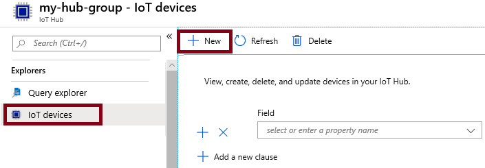

---
wts:
  title: 07 - تنفيذ Azure IoT Hub (10 دقائق)
  module: 'Module 03: Describe core solutions and management tools'
ms.openlocfilehash: c2098875e07323c84eac8a405c8a59ad70eaabcd
ms.sourcegitcommit: 26c283fffdd08057fdce65fa29de218fff21c7d0
ms.translationtype: HT
ms.contentlocale: ar-SA
ms.lasthandoff: 01/27/2022
ms.locfileid: "137907265"
---
# 07 - تنفيذ Azure IoT Hub (10 دقائق)

في هذه المعاينة، سنكوّن Azure IoT Hub جديد في مدخل Azure، ثم نصادق الاتصال بجهاز IoT باستخدام محاكي جهاز Raspberry Pi عبر الإنترنت. يتم تمرير بيانات الاستشعار والرسائل من محاكي Raspberry Pi إلى Azure IoT Hub، ويمكنك عرض مقاييس نشاط المراسلة في مدخل Azure.

# المهمة 1: إنشاء مركز IoT 

في هذه المهمة، سننشئ IoT Hub. 

1. سجل الدخول إلى [مدخل Azure](https://portal.azure.com).

2. من نافذة **جميع الخدمات**، ابحث عن **IoT Hub** وحدده، ثم انقر فوق **+إضافة، +إنشاء، +جديد**.

3. في علامة تبويب **الأساسيات** من نافذة **IoT Hub**، املأ الحقول بالبيانات التالية (استبدل **xxxx** في اسم حساب التخزين بأحرف وأرقام بحيث يكون الاسم فريدًا بشكل عام).

    | الإعدادات | القيمة |
    |--|--|
    | الاشتراك | **احتفظ بالإعداد الافتراضي المقدم** |
    | مجموعة الموارد | **إنشاء مجموعة موارد جديدة** |
    | اسم مركز IoT | **my-hub-groupxxxxx** |
    | المنطقة | **شرق الولايات المتحدة** |

    **ملحوظة** - تذكر تغيير **xxxxx** بحيث يكوّن **IoT Hub Name** فريدًا.

4. انتقل إلى علامة تبويب **Management**، واستخدم القائمة المنسدلة لتعيين **Pricing and scale tier** على **S1: المستوى القياسي**.

5. انقر فوق الزر ⁧**⁩⁩Review + create⁦⁧**⁩⁩.

6. انقر فوق زر **إنشاء** لبدء إنشاء مثيل Azure IoT Hub الجديد.

7. انتظر لحين توزيع مثيل Azure IoT Hub. 

# المهمة 2: إضافة جهاز IoT

في هذه المهمة، سنضيف جهاز IoT إلى IoT Hub. 

1. عند اكتمال التوزيع، انقر فوق **الانتقال إلى المورد** من نافذة التوزيع. بدلاً من ذلك، من نافذة **جميع الخدمات**، ابحث عن **IoT Hub** وحدده وحدد موقع مثيل IoT Hub الجديد الخاص بك

    

2. لإضافة جهاز IoT جديد، مرر لأسفل إلى قسم **Device management** وانقر فوق **Devices**. ثم انقر فوق **+ Add Device**.

    

3. أدخل اسمًا لجهاز IoT الجديد، **myRaspberryPi**، وانقر فوق زر **حفظ**. سيؤدي ذلك إلى إنشاء هوية جديدة لجهاز IoT في Azure IoT Hub.

4. إذا كنت لا ترى جهازك الجديد، فعليك **بتحديث** صفحة أجهزة IoT. 

5. حدد **myRaspberryPi** وانسخ قيمة **سلسلة الاتصال الأساسية**. ستستخدم هذا المفتاح في المهمة التالية لمصادقة اتصال بمحاكي Raspberry Pi.

    

# المهمة 3: اختبار الجهاز باستخدام محاكي Raspberry Pi

في هذه المهمة، سنختبر أجهزتنا باستخدام محاكي Raspberry Pi. 

1. افتح علامة تبويب جديدة في مستعرض الويب واكتب رابط الاختصار هذا https://aka.ms/RaspPi. سينقلك إلى موقع محاكي Raspberry Pi. إذا كان لديك الوقت، فاقرأ عن محاكي Raspberry Pi. عند الانتهاء، حدد **X** لإغلاق النافذة المنبثقة.

2. في منطقة الكود، على الجانب الأيمن، حدد السطر الذي يحتوي على "const connectionString =". استبدلها بسلسلة الاتصال التي نسخْتها من مدخل Azure. لاحظ أن سلسلة الاتصال تتضمن DeviceId **myRaspberryPi**) وإدخالات SharedAccessKey.

    

3. انقر فوق **تشغيل** (أسفل منطقة الكود) لتشغيل التطبيق. ينبغي أن يعرض إخراج وحدة التحكم بيانات المستشعر والرسائل التي تُرسل من محاكي Raspberry Pi إلى Azure IoT Hub. تُرسَل البيانات والرسائل في كل مرة يومض فيها ضوء LED الخاص بمحاكي Raspberry Pi. 

    

5. انقر فوق **إيقاف** لإيقاف إرسال البيانات.

6. ارجع إلى مدخل Azure.

7. بدّل نافذة **نظرة عامة** على IoT Hub ومرر لأسفل إلى معلومات **استخدام IoT Hub** لعرض الاستخدام. قم بتغيير الإطار الزمني الخاص بك في **بيانات العرض لآخر** لمشاهدة البيانات في آخر ساعة.

    

تهانينا! لقد أعددتَ Azure IoT Hub لجمع بيانات المستشعر من جهاز IoT.

**ملاحظة**: لتجنب التكاليف الإضافية، يمكنك اختياريًا إزالة مجموعة الموارد هذه. ابحث عن مجموعات الموارد، وانقر فوق مجموعة الموارد الخاصة بك، ثم انقر فوق **حذف مجموعة الموارد**. تحقق من اسم مجموعة الموارد ثم انقر فوق **حذف**. راقب **الإعلامات** لترى كيف تجري عملية الحذف.
