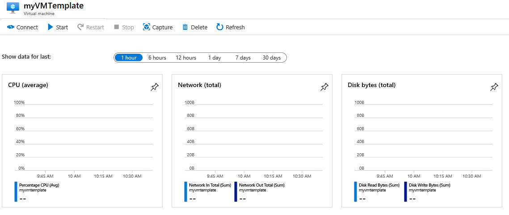

---
wts:
  title: 09 - إنشاء جهاز ظاهري باستخدام قالب (10 دقائق)
  module: 'Module 03: Describe core solutions and management tools'
ms.openlocfilehash: d4d29b62fc5dfa2e050ac51fcf4d5067e8fd3283
ms.sourcegitcommit: 26c283fffdd08057fdce65fa29de218fff21c7d0
ms.translationtype: HT
ms.contentlocale: ar-SA
ms.lasthandoff: 01/27/2022
ms.locfileid: "137907260"
---
# 09 - إنشاء جهاز ظاهري باستخدام قالب (10 دقائق)

في هذه المعاينة، سنوزع جهازًا ظاهريًا مع قالب QuickStart ونفحص إمكانات المراقبة.

# المهمة 1: استكشف معرض "التشغيل السريع" وحدد موقع قالب 

في هذه المهمة، نستعرض معرض Azure QuickStart ونوزع قالبًا يُنشئ جهازًا ظاهريًا. 

1. داخل بيئة المعمل، افتح نافذة مستعرض جديدة، وأدخل T https://azure.microsoft.com/en-us/resources/templates/?azure-portal=true. ستجد في المعرض عددًا من القوالب الشائعة والتي تم تحديثها مؤخرًا. تعمل هذه القوالب على أتمتة توزيع موارد Azure، بما في ذلك تثبيت حزم البرامج الشائعة. استعرض العديد من أنواع القوالب المختلفة المتوفرة.

3. حدد خيار **توزيع Windows VM بسيط**

4. انقر فوق زر **"Deploy to Azure"** . ستتم إعادة توجيه جلسة المستعرض تلقائيًا إلى [مدخل Azure](http://portal.azure.com/).

  **ملاحظة**: يمكّنك زر **توزيع على Azure** من توزيع القالب عبر مدخل Azure. أثناء هذا التوزيع، ستتم مطالبتك فقط بمجموعة صغيرة من معلمات التكوين. 

5. عند المطالبة، قم بتسجيل الدخول إلى اشتراك Azure باستخدام بيانات الاعتماد المتوفرة مسبقًا في التعليمات.

6. انقر فوق **تحرير القالب**. يستخدم تنسيق قالب إدارة الموارد تنسيق JSON. راجع المعلمات والمتغيرات.  ثم حدد موقع معلمة اسم الجهاز الظاهري. غيّر الاسم إلى **myVMTemplate**. **احفظ** تغييراتك. 

    

7. الآن تكوين المعلمات المطلوبة من قبل القالب (استبدل ***xxxx*** في بادئة تسمية DNS بأحرف وأرقام بحيث تكون التسمية فريدة من نوعها عالميًا). اترك الإعدادات الافتراضية لكل شيء آخر. 

    | إعداد| القيمة|
    |----|----|
    | الاشتراك | **احتفظ بالإعداد الافتراضي المقدم**|
    | مجموعة الموارد | **إنشاء مجموعة موارد جديدة** |
    | المنطقة | احتفظ بالإعداد الافتراضي |
    | ⁧⁩الاسم الخاص بالمستخدم المسؤول⁧⁩ | **azureuser** |
    | كلمة مرور المسؤول | **Pa$$w0rd1234** |
    | بادئة تسمية DNS | **myvmtemplatexxxx** |
    | ⁧⁩OS version⁧⁩ | **2019-Datacenter** |

9. انقر فوق **"Review + Create"**.

10. راقب التوزيع. 

# المهمة 2: تحقق من توزيع جهاز ظاهري خاص بك وراقبه

في هذه المهمة، سنتحقق من توزيع الجهاز الظاهري بشكل صحيح. 

1. من نافذة **جميع الخدمات**، ابحث عن **الأجهزة الظاهرية** وحددها.

2. تأكد من إنشاء جهازك الظاهري الجديد. 

    

3. حدد جهازك الظاهري وفي جزء **نظرة عامة**، حدد علامة التبويب **المراقبة**، ومرر لأسفل لعرض بيانات المراقبة.

    **ملاحظة**: يمكن تعديل الإطار الزمني للمراقبة من ساعة واحدة إلى 30 يومًا.

4. راجع مختلف المخططات المتوفرة بما في ذلك **وحدة المعالجة المركزية (المتوسط)** و **الشبكة (الإجمالي)** و **مساحة القرص (الإجمالي)** . 

    

5. انقر فوق أي مخطط. لاحظ أنه يمكنك **إضافة قياس** وتغيير نوع المخطط.

6. العودة إلى شفرة **"Overview"**. (حرك شريط التبديل إلى اليسار)
7. انقر فوق **سجل النشاط** (الجزء الأيسر). تُسجل سجلات النشاط هذه الأحداث مثل إنشاء الموارد أو تعديلها. 

8. انقر فوق **إضافة عامل تصفية**، وجرب البحث عن أنواع وعمليات مختلفة للأحداث. 

    

تهانينا! لقد نجحت في إنشاء مورد من قالب، ووزعت هذا القالب في Azure.

**ملاحظة**: لتجنب التكاليف الإضافية، يمكنك اختياريًا إزالة مجموعة الموارد هذه. ابحث عن مجموعات الموارد، وانقر فوق مجموعة الموارد الخاصة بك، ثم انقر فوق **حذف مجموعة الموارد**. تحقق من اسم مجموعة الموارد ثم انقر فوق **حذف**. راقب **الإعلامات** لترى كيف تجري عملية الحذف.
