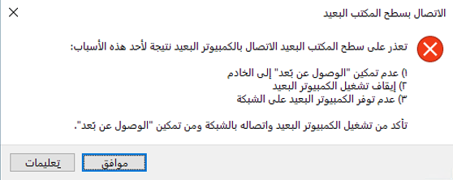

---
wts:
  title: 13 - تأمين نسبة استخدام الشبكة (10 دقائق)
  module: 'Module 04: Describe general security and network security features'
ms.openlocfilehash: 27216b913111de76e00546319b56f69034819918
ms.sourcegitcommit: 26c283fffdd08057fdce65fa29de218fff21c7d0
ms.translationtype: HT
ms.contentlocale: ar-SA
ms.lasthandoff: 01/27/2022
ms.locfileid: "137907247"
---
# 13 - تأمين نسبة استخدام الشبكة (10 دقائق)

في هذه المعاينة، سنكوّن مجموعة أمان الشبكة.

# المهمة 1: إنشاء جهاز ظاهري

في هذه المهمة، سننشئ جهازًا ظاهريًا لمركز بيانات Windows Server 2019. 

1. سجل الدخول إلى [مدخل Azure](https://portal.azure.com).

2. من نافذة **جميع الخدمات**، ابحث عن **الشبكات الظاهرية** وحددها، ثم انقر فوق **+إضافة، +إنشاء، + جديد** جهاز ظاهري.

3. في علامة تبويب **الأساسيات**، اكتب المعلومات التالية (اترك الإعدادات الافتراضية لكل شيء آخر):

    | الإعدادات | القيم |
    |  -- | -- |
    | الاشتراك | **استخدم الإعداد الافتراضي المقدم** |
    | مجموعة الموارد | **إنشاء مجموعة موارد جديدة** |
    | اسم الجهاز الظاهري | **SimpleWinVM** |
    | المنطقة | **(US) East US**|
    | صورة | **Windows Server 2019 Datacenter Gen 2**|
    | الحجم | **Standard D2s v3**|
    | اسم مستخدم حساب المسؤول | **azureuser** |
    | كلمة مرور حساب المسؤول | **Pa$$w0rd1234**|
    | قواعد منفذ الوارد | **بلا**|

4. قم بالتبديل إلى علامة تبويب **الشبكة**، وكوّن الإعداد التالي:

    | الإعدادات | القيم |
    | -- | -- |
    | مجموعة الأمان للشبكة NIC | **بلا**|

5. قم بالتبديل إلى علامة تبويب **الإدارة**، وفي قسم **المراقبة** ضمنها، حدد الإعداد التالي:

    | الإعدادات | القيم |
    | -- | -- |
    | تشخيص التمهيد | **تعطيل**|

6. اترك الإعدادات الافتراضية المتبقية ثم انقر فوق زر **مراجعة + إنشاء** في أسفل الصفحة.

7. بمجرد اجتياز التحقق من الصحة، انقر فوق زر **إنشاء**. قد يستغرق توزيع الجهاز الظاهري نحو خمس دقائق.

8. راقب التوزيع. قد يستغرق إنشاء مجموعة الموارد والجهاز الظاهري بضع دقائق. 

9. من نافذة التوزيع أو من منطقة الإعلامات، انقر فوق **الانتقال إلى المورد**. 

10. في نافذة الجهاز الظاهري **SimpleWinVM**، انقر فوق **الشبكة**، وراجع علامة تبويب **قواعد منفذ الوارد**، ولاحظ عدم وجود مجموعة أمان شبكة مرتبطة بواجهة الشبكة الخاصة بالجهاز الظاهري أو الشبكة الفرعية التي تتصل بها واجهة الشبكة.

    **ملاحظة**: حدد اسم واجهة الشبكة. ستحتاجه في المهمة التالية.

# المهمة 2: إنشاء مجموعة أمان للشبكة

في هذه المهمة، سننشئ مجموعة أمان للشبكة ونربطها بواجهة الشبكة. 

1. من نافذة **جميع الخدمات**، ابحث عن **مجموعات أمان الشبكة** وحددها، ثم انقر فوق **+إضافة، +إنشاء، +جديد**

2. في علامة تبويب **الأساسيات** في نافذة **إنشاء مجموعة أمان الشبكة**، حدد الإعدادات التالية.

    | إعداد | القيمة |
    | -- | -- |
    | الاشتراك | **استخدام الاشتراك الافتراضي** |
    | مجموعة الموارد | **حدد default من القائمة المنسدلة** |
    | الاسم | **myNSGSecure** |
    | المنطقة | **(US) East US**  |

3. انقر فوق **مراجعة + إنشاء**، ثم انقر فوق **إنشاء** بعد التحقق من الصحة.

4. بعد إنشاء مجموعة أمان الشبكة، انقر فوق **الانتقال إلى المورد**.

5. ضمن **Settings**، انقر فوق **Network interfaces** ثم ** Associate**.

6. حدد واجهة الشبكة التي حددتها في المهمة السابقة. 

# المهمة 3: تكوين قاعدة منفذ أمان وارد للسماح بـ RDP

في هذه المهمة، سنسمح بنسبة استخدام شبكة RDP إلى الجهاز الظاهري عن طريق تكوين قاعدة منفذ أمان وارد. 

1. في مدخل Azure، انتقل إلى نافذة الجهاز الظاهري **SimpleWinVM**. 

2. في جزء **نظرة عامة**، انقر فوق **اتصال**.

3. حاول الاتصال بالجهاز الظاهري عن طريق تحديد RDP وتنزيل ملف RDP قيد التشغيل. بشكل افتراضي، لا تسمح مجموعة أمان الشبكة بـ RDP. أغلق نافذة الخطأ. 

    

4. في نافذة الجهاز الظاهري، مرر لأسفل إلى قسم **الإعدادات**، وانقر فوق **الشبكة**، ولاحظ قواعد الوارد لمجموعة أمان الشبكة **myNSGSecure (المرفقة بواجهة الشبكة: myVMNic)** التي ترفض جميع نسب استخدام الشبكة الواردة باستثناء نسبة استخدام الشبكة داخل الشبكة الظاهرية وتحقيقات موازن التحميل.

5. في علامة تبويب **قواعد منفذ الوارد**، انقر فوق **إضافة قاعدة منفذ الوارد**. انقر فوق **إضافة** عند الاكتمال. 

    | إعداد | القيمة |
    | -- | -- |
    | المصدر | **أي**|
    | نطاقات منافذ المصادر | **\*** |
    | الوجهة | **أي** |
    | نطاقات المنفذ الوجهات | **3389** |
    | البروتوكول | **بروتوكول تحكم الإرسال** |
    | إجراء | **السماح** |
    | أولوية | **300** |
    | الاسم | **AllowRDP** |

6. حدد **إضافة**، وانتظر حتى يتم توفير القاعدة ثم حاول مرة أخرى استخدام RDP في الجهاز الظاهري بالرجوع إلى **توصيل**، وهذه المرة يجب أن تنجح. تذكر أن المستخدم هو **azureuser** وكلمة المرور هي **Pa$$w0rd1234**.

# المهمة 4: تكوين قاعدة منفذ أمان صادر لحجب الوصول إلى الإنترنت

في هذه المهمة، سننشئ قاعدة منفذ صادر لمجموعة NSG تحجب الوصول إلى الإنترنت ثم نختبرها للتأكد من عمل القاعدة.

1. استمر في جلسة RDP الخاصة بجهازك الظاهري. 

2. بعد بدء تشغيل الجهاز، افتح مستعرض **Internet Explorer**. 

3. تحقق من إمكانية الوصول إلى **https://www.bing.com** ثم أغلق Internet Explorer. ستحتاج إلى العمل من خلال النوافذ المنبثقة للأمان المحسّن في IE. 

    **ملاحظة**: سنكوّن الآن قاعدة لحجب الوصول إلى الإنترنت الصادر. 

4. بالعودة إلى مدخل Azure، انتقل مرة أخرى إلى نافذة الجهاز الظاهري **SimpleWinVM**. 

5. ضمن **الإعدادات**، انقر فوق **الشبكة**، ثم **قواعد منفذ الصادر**.

6. لاحظ أن هناك قاعدة، **AllowInternetOutbound**. هذه قاعدة افتراضية ولا يمكن إزالتها. 

7. انقر فوق **إضافة قاعدة منفذ صادر** على يمين مجموعة أمان شبكة **myNSGSecure (المرفقة بواجهة الشبكة: myVMNic)** وكوّن قاعدة أمان صادرة جديدة ذات أولوية أعلى تحجب نسبة استخدام شبكة الإنترنت. انقر فوق **إضافة** عند الانتهاء. 

    | إعداد | القيمة |
    | -- | -- |
    | المصدر | **أي**|
    | نطاقات منافذ المصادر | **\*** |
    | الوجهة | **علامة الخدمة** |
    | علامة خدمة الوجهة | **الإنترنت** |
    | نطاقات المنفذ الوجهات | **\*** |
    | البروتوكول | **بروتوكول تحكم الإرسال** |
    | إجراء | **Deny** |
    | أولوية | **4000** |
    | الاسم | **DenyInternet** |

8. انقر فوق **إضافة**، وارجع إلى الجهاز الظاهري الذي أنشأت له RDP. 

9. استعرض إلى **https://www.microsoft.com**. لا ينبغي عرض الصفحة. قد تحتاج إلى العمل من خلال النوافذ المنبثقة الإضافية للأمان المحسّن في IE.  

**ملاحظة**: لتجنب التكاليف الإضافية، يمكنك اختياريًا إزالة مجموعة الموارد هذه. ابحث عن مجموعات الموارد، وانقر فوق مجموعة الموارد الخاصة بك، ثم انقر فوق **حذف مجموعة الموارد**. تحقق من اسم مجموعة الموارد ثم انقر فوق **حذف**. راقب **الإعلامات** لترى كيف تجري عملية الحذف.
