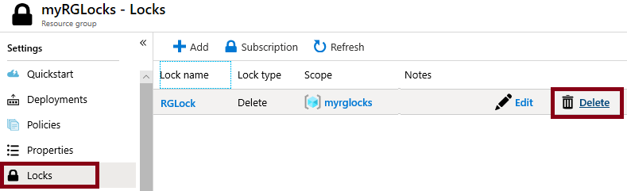

---
wts:
  title: 15 - إدارة أقفال الموارد (5 دقائق)
  module: 'Module 05: Describe identity, governance, privacy, and compliance features'
ms.openlocfilehash: 47c915f02f041a8af82057e95069b3cf9f73704c
ms.sourcegitcommit: 26c283fffdd08057fdce65fa29de218fff21c7d0
ms.translationtype: HT
ms.contentlocale: ar-SA
ms.lasthandoff: 01/27/2022
ms.locfileid: "137907242"
---
# 15 - إدارة أقفال الموارد (5 دقائق)

في هذه المعاينة، سنضيف قفلًا إلى مجموعة الموارد ونختبر حذف مجموعة الموارد. يمكن تطبيق أقفال في الاشتراك في مجموعات الموارد أو الموارد الفردية لمنع الحذف أو التعديل العرضي للموارد الهامة.  

# المهمة 1:  إضافة قفل إلى مجموعة الموارد واختبار الحذف

في هذه المهمة، سنضيف قفل مورد إلى مجموعة الموارد ونختبر حذف مجموعة الموارد. 

1. سجل الدخول إلى [مدخل Azure](https://portal.azure.com).

2. في مدخل Azure، انتقل إلى مجموعة الموارد **myRGLocks**.

3. يمكنك تطبيق قفل على اشتراك أو مجموعة موارد أو مورد فردي لمنع الحذف أو التعديل العرضي للموارد الهامة. 

4. في قسم **"Settings"** انقر فوق **"Locks"**، ثم انقر فوق **"+ Add"**. 

    

5. تكوين القفل الجديد. عند الانتهاء، انقر فوق **موافق**. 

    | إعداد | القيمة |
    | -- | -- |
    | اسم التأمين | '''RGLock''' |
    | نوع القفل | **حذف** |
    | | |

6. انقر فوق **نظرة عامة** وانقر فوق **حذف مجموعة الموارد**. اكتب اسم مجموعة الموارد وانقر فوق **"OK"**. تلقيتَ رسالة خطأ تفيد بأن مجموعة الموارد مقفلة ولا يمكن حذفها.

    

# المهمة 2: اختبار حذف عضو من مجموعة الموارد

في هذه المهمة، سنختبر ما إذا كان قفل المورد يحمي حساب تخزين في مجموعة الموارد أم لا. 

1. من نافذة **جميع الخدمات**، ابحث عن **حسابات التخزين** وحددها، ثم انقر فوق **+ إضافة أو + إنشاء أو + جديد**. 

2. في صفحة **Storage Accounts** جزء **+Add +New +Create **، قم بتعبئة المعلومات التالية (استبدل **xxxx** باسم حساب التخزين بأحرف وأرقام بحيث يكون اسم فريد عمومي). اترك الإعدادات الافتراضية لكل شيء آخر.

    | إعداد | القيمة | 
    | --- | --- |
    | الاشتراك | **حدد اشتراكك** |
    | مجموعة الموارد | **myRGLocks** |
    | اسم حساب التخزين | **storageaccountxxxx** |
    | ‏‏الموقع | **(US) East US**  |
    | الأداء | **قياسي** |
    | نوع الحساب | **StorageV2 (general purpose v2)** |
    | النسخ المتماثل | **التخزين المتكرر محليًا (LRS)** |
    | طبقة التخزين (افتراضي) | **Hot** |
   

3. انقر فوق **مراجعة + إنشاء** لمراجعة إعدادات حساب التخزين وتمكين Azure من التحقق من صحة التكوين. 

4. بمجرد التحقق، انقر فوق **إنشاء**. انتظر إعلامًا بأن الحساب قد تم إنشاؤه بنجاح. 

5.  انتظر إعلامًا بأن حساب التخزين قد تم إنشاؤه بنجاح. 

6. قم بالوصول إلى حساب التخزين الجديد الخاص بك ومن جزء **نظرة عامة**، انقر فوق **حذف**. تتلقى رسالة خطأ تفيد المورد أو أصله تأمين حذف. 

    

    **ملاحظة**: رغم أننا لم ننشئ قفلًا على وجه التحديد لحساب التخزين، فقد أنشأنا قفلًا على مستوى مجموعة الموارد، والذي يحتوي على حساب التخزين. على هذا النحو، يمنعنا قفل المستوى *الأصل* هذا من حذف المورد ويكتسب حساب التخزين القفل من الأصل.

# المهمة 3: إزالة قفل المورد

في هذه المهمة، سنزيل قفل المورد ونختبره. 

1. ارجع إلى نافذة مجموعة موارد **myRGLocks-XXXXXXXX**، وفي قسم **الإعدادات**، انقر فوق **الأقفال**.
    
2. انقر فوق **حذف** الارتباط الموجود في أقصى يمين إدخال **myRGLocks-XXXXXXXX**، وإلى يمين **تحرير**.

    

3. ارجع إلى نافذة حساب التخزين وتأكد من أنه يمكنك الآن حذف المورد.

تهانينا! لقد أنشأتَ مجموعة موارد وأضفتَ قفلًا إلى مجموعة الموارد واختبرتَ الحذف واختبرتَ حذف مورد في مجموعة الموارد وأزلتَ قفل المورد. 

**ملاحظة**: لتجنب التكاليف الإضافية، يمكنك اختياريًا إزالة مجموعة الموارد هذه. ابحث عن مجموعات الموارد، وانقر فوق مجموعة الموارد الخاصة بك، ثم انقر فوق **حذف مجموعة الموارد**. تحقق من اسم مجموعة الموارد ثم انقر فوق **حذف**. راقب **الإعلامات** لترى كيف تجري عملية الحذف.
