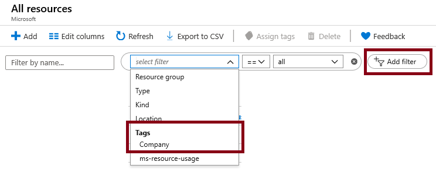

---
wts:
  title: 16 - تنفيذ وضع علامات للموارد (5 دقائق)
  module: 'Module 05: Describe identity, governance, privacy, and compliance features'
ms.openlocfilehash: cc7a298eb03be3dfcbcc1c69cfa7409bc94c0640
ms.sourcegitcommit: dfe52fea15c568547ba630e9b337ec8df957ad80
ms.translationtype: HT
ms.contentlocale: ar-SA
ms.lasthandoff: 02/25/2022
ms.locfileid: "139213859"
---
# 16 - تنفيذ وضع علامات للموارد (5 دقائق)

في هذه المعاينة، سننشئ عملية تعيين نهج تتطلب وضع علامات وإنشاء حساب تخزين واختبار العلامات وعرض الموارد بعلامة محددة وإزالة نهج وضع العلامات.

# المهمة 1: إنشاء تعيين نهج 

في هذه المهمة، سنكوّن نهج **طلب وضع علامة على الموارد** ونعيّنه إلى اشتراكنا. 

1. تسجيل الدخول إلى ⁧[⁩مدخل Azure⁧](https://portal.azure.com)⁩.

2. من نافذة **جميع الخدمات**، ابحث عن **النهج** وحدده.

3. مرر لأسفل إلى قسم **التأليف**، وانقر فوق **التعيينات**، ثم انقر فوق **تعيين نهج** من أعلى الصفحة.

4. لاحظ أن **نطاق** نهجنا سيكون الاشتراك على نطاق واسع. 

5. ضمن **الأساسيات**، حدد زر علامة حذف **تعريف النهج** (الجانب الأيمن من مربع النص). في مربع **البحث**، أدخل **علامة** القيمة. ستظهر قائمة بالنُهج ذات الصلة مع **علامة** الكلمة. مرر لأسفل حتى تجد تعريف **Require a tag and its value on resources**، انقر فوقه وانقر فوق **Select**.

   
   
6.  في علامة تبويب **Parameters**، اكتب **Company : Contoso ** لعلامة اسم زوج المفتاح/القيمة. انقر فوق **مراجعة + إنشاء**، ثم **إنشاء**.

  

7. أصبحت عملية تعيين نهج **Require a tag amd its value on resources** في مكانها الآن. عند إنشاء مورد، يجب أن يتضمن علامة للشركة: مفتاح Contoso.
   **ملاحظة - عليك الانتظار لمدة 30 دقيقة لحين تطبيق النهج.** 

  

# المهمة 2: إنشاء حساب تخزين لاختبار وضع العلامات المطلوبة

في هذه المهمة، سننشئ حسابات تخزين لاختبار وضع العلامات المطلوبة. 

1. في مدخل Azure، من نافذة **جميع الخدمات**، ابحث عن **حسابات التخزين** وحددها، ثم انقر فوق **+إضافة، +إنشاء، +جديد**.

2. في علامة تبويب **الأساسيات** من نافذة **إنشاء حساب تخزين**، اكتب البيانات التالية (استبدل **xxxx** في اسم حساب التخزين بأحرف وأرقام بحيث يكون الاسم فريدًا بشكل عام). اترك الإعدادات الافتراضية لكل شيء آخر.

    | إعداد | القيمة | 
    | --- | --- |
    | الاشتراك | **استخدم الإعداد الافتراضي المقدم** |
    | مجموعة الموارد | **أنشئ مجموعة موارد جديدة** |
    | اسم حساب التخزين | **storageaccountxxxx** |
    | ‏‏الموقع | **(US) East US** |

3. انقر فوق **مراجعة + إنشاء**. 

    **ملاحظة:** نُجري الاختبار لنرى ماذا يحدث في حالة عدم توفير العلامة. ملحوظة: قد يستغرق دخول النهج حيز التنفيذ ما يصل إلى 30 دقيقة.

4. سوف تتلقى رسالة فشل التحقق من الصحة. انقر فوق رسالة **انقر هنا لعرض التفاصيل**. في **نافذة الأخطاء**، في علامة تبويب **الملخص**، لاحظ رسالة الخطأ التي تفيد بأن هذا المورد غير مسموح به من قِبل النهج.

    **ملاحظة:** إذا عرضتَ علامة تبويب الخطأ الأولي، فسترى اسم العلامة المحدد المطلوب. 

    

5. أغلق جزء **الخطأ** وانقر فوق **السابق** (أسفل الشاشة). قدّم معلومات وضع العلامات. 

    | إعداد | القيمة | 
    | --- | --- |
    | اسم العلامة | **Company:Contoso** (قد لا تكون في القائمة المنسدلة) |

6. انقر فوق **مراجعة + إنشاء** وتحقق من إتمام عملية التحقق بنجاح. انقر فوق **إنشاء** لتوزيع حساب التخزين. 

# المهمة 3: عرض جميع الموارد التي تحمل علامة محددة

1. في مدخل Azure، من نافذة **جميع الخدمات**، ابحث عن **العلامات** وحددها.

2. لاحظ كل العلامات وقيمها. انقر فوق **Company : Contoso** زوج المفتاح/القيمة. سيعرض هذا نافذة تعرض حساب التخزين الذي تم إنشاؤه حديثًا، طالما قمت بتضمين العلامة أثناء توزيعها. 

   

3. في المدخل، اعرض نافذة **جميع الموارد**.

4. انقر فوق **إضافة عامل تصفية** وأضف مفتاح علامة **الشركة** كفئة عامل التصفية. مع تطبيق عامل التصفية، سيتم إدراج حساب التخزين الخاص بك فقط.

    

# المهمة 4: احذف تعيين النهج

في هذه المهمة، سنزيل نهج **طلب وضع علامة على الموارد** حتى لا يؤثر على عملنا المستقبلي. 

1. في المدخل، من نافذة **جميع الخدمات**، ابحث عن **النهج** وحدده.

2. انقر فوق إدخال نهج **طلب وضع علامة على الموارد**.

3. انقر فوق **حذف التعيين** في القائمة العلوية.

4. أكد رغبتك في حذف تعيين النهج في مربع حوار **حذف التعيين** بالنقر فوق **نعم**

5. إذا كان لديك الوقت الكافي، فأنشئ موردًا آخر بدون علامة للتأكد من أن النهج لم يعد ساريًا.

تهانينا! في هذه المعاينة، أنشأنا عملية تعيين نهج تتطلب وضع علامات وأنشأنا (حساب تخزين) للمورد، واختبرنا نهج وضع العلامات وعرضنا الموارد بعلامة محددة وأزلنا نهج وضع العلامات.

**ملاحظة**: لتجنب التكاليف الإضافية، يمكنك اختياريًا إزالة مجموعة الموارد هذه. ابحث عن مجموعات الموارد، وانقر فوق مجموعة الموارد الخاصة بك، ثم انقر فوق **حذف مجموعة الموارد**. تحقق من اسم مجموعة الموارد ثم انقر فوق **حذف**. راقب **الإعلامات** لترى كيف تجري عملية الحذف.
