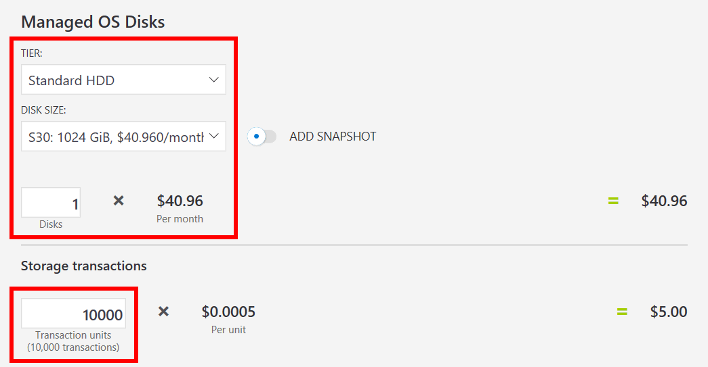

---
wts:
  title: "\"19 - استخدام حاسبة تسعير Azure (10 دقائق)"
  module: 'Module 06: Describe Azure cost management and service level agreements'
ms.openlocfilehash: 9b071ca3caa80cc8f78541a61010b5b2d0fe8053
ms.sourcegitcommit: 26c283fffdd08057fdce65fa29de218fff21c7d0
ms.translationtype: HT
ms.contentlocale: ar-SA
ms.lasthandoff: 01/27/2022
ms.locfileid: "137907221"
---
# 19 - استخدام حاسبة التسعير (10 دقائق)

في هذه المعاينة، سنستخدم حاسبة تسعير Azure لإنشاء تقدير التكلفة لجهاز Azure الظاهري وموارد الشبكة ذات الصلة.

# المهمة 1: كوِّن حاسبة التسعير

في هذه المهمة، سنقدّر تكلفة عينة بنية أساسية باستخدام حاسبة تسعير Azure. 

**ملاحظة**: لإنشاء تقدير حاسبة تسعير Azure، توفر هذه المعاينة أمثلة لتكوينات الجهاز الظاهري والموارد ذات الصلة. استخدم تكوينات المثال هذا أو قم بتزويد حاسبة تسعير Azure بتفاصيل متطلبات الموارد *الفعلية* بدلاً من ذلك.

1. في المستعرض، انتقل إلى صفحة ويب [حاسبة تسعير Azure](https://azure.microsoft.com/en-us/pricing/calculator/).

2. لإضافة تفاصيل تكوين الجهاز الظاهري الخاص بك، انقر فوق **الأجهزة الظاهرية** في علامة تبويب **المنتجات**. مرر لأسفل لعرض تفاصيل الجهاز الظاهري. 

3. استبدل نص **التقدير** والأجهزة **الظاهرية** بأسماء أكثر وصفية لتقدير حاسبة تسعير Azure وتكوين الجهاز الظاهري. تستخدم هذه المعاينة التمثيلية تقدير **حاسبة التسعير الخاصة بي** للتقدير، و **جهاز Windows الظاهري** لتكوين الجهاز الظاهري.

   

4. عدّل التكوين الافتراضي للجهاز الظاهري.

    | الإعدادات | القيمة |
    | -- | -- |
    | المنطقة | **شمال أوروبا** |
    | نظام التشغيل | **Windows** |
    | النوع | **(OS only)** |
    | المستوى | ⁧**⁩القياسي⁧**⁩ |  
    | المثيل | **A2: 2 ذاكرة أساسية (ذاكرات أساسية)، 3.5 جيجابايتRAM، 135 جيجابايت من التخزين المؤقت** |

   

    **ملاحظة**: قد تختلف مواصفات وأسعار مثيل الجهاز الظاهري عن تلك الموجودة في هذا المثال. اتبع هذه المعاينة عن طريق اختيار مثيل يطابق المثال بأكبر قدر ممكن. لعرض تفاصيل بشأن خيارات منتج الجهاز الظاهري المختلفة، اختر **تفاصيل المنتج** من قائمة **مزيد من المعلومات** على اليمين.

5. عيّن **خيار الفواتير** على **الدفع حسب الاستخدام**.

   

6. في Azure، يتم تعريف الشهر على أنه 730 ساعة. إذا كانت هناك ضرورة لأن يكون جهازك الظاهري متاحًا بنسبة 100 بالمائة من الوقت كل شهر، يمكنك تعيين قيمة الساعات في الشهر على `730`. تتطلب هذه المعاينة التمثيلية إتاحة جهاز ظاهري واحد بنسبة 50 بالمائة من الوقت كل شهر.

    اترك عدد الأجهزة الظاهرية مضبوطًا على `1`، وقم بتغيير قيمة الساعات في الشهر إلى `365`.

   

7. في جزء **أقراص نظام التشغيل المُدارة**، عدّل تكوين تخزين الجهاز الظاهري الافتراضي.

    | المستوى | حجم القرص | ⁧⁩ عدد الأقراص⁧⁩ | اللقطة | عمليات التخزين |
    | ---- | --------- | --------------- | -------- | -------------------- |
    | Standard HDD | S30: 1024 جيبي بايت | 1 | إيقاف تشغيل | 10,000 |

   

8. لإضافة النطاق الترددي للشبكة إلى تقديرك، انتقل إلى أعلى صفحة ويب حاسبة تسعير Azure. انقر فوق **الشبكة** في قائمة المنتج على اليسار، ثم انقر فوق مربع **النطاق الترددي**. في مربع حوار رسالة **النطاق الترددي المضاف**، انقر فوق **عرض**.

   

9. أضف اسمًا لتكوين النطاق الترددي لجهازك الظاهري. يستخدم هذه المعاينة التمثيلية اسم **Bandwidth: الجهاز الظاهري الذي يعمل بنظام Windows**. عدّل تكوين النطاق الترددي الافتراضي عن طريق إضافة التفاصيل التالية.

    | المنطقة | مقدار نقل البيانات الصادرة للمنطقة 1 |
    | ------ | -------------------------------------- |
    | شمال أوروبا | 50 جيجا بايت |

   

10. لإضافة بوابة تطبيق، ارجع إلى أعلى صفحة ويب حاسبة تسعير Azure. في قائمة منتج **الشبكة**، انقر فوق لوحة **بوابة التطبيق**. في مربع حوار رسالة **بوابة التطبيق**، انقر فوق **عرض**.

    

11. أضف اسمًا لتكوين بوابة التطبيق. تستخدم هذه المعاينة اسم **App Gateway: الجهاز الظاهري الذي يعمل بنظام Windows**. عدّل تكوين بوابة التطبيق الافتراضي عن طريق إضافة التفاصيل التالية.

    | الإعدادات | القيمة |
    | -- | -- |
    | المنطقة | **شمال أوروبا** |
    | المستوى | **أساسي** |
    | الحجم | **صغير** |
    | مثيلات | **1** |  
    | ساعات | **365** |
    | البيانات التي تمت معالجتها | **50 جيجا بايت** |
    | المنطقة 1: أمريكا الشمالية وأوروبا | **50 جيجا بايت**|

    

# المهمة 2: مراجعة تقدير التسعير

في هذه المهمة، سنراجع نتائج حاسبة تسعير Azure. 

1. مرر إلى أسفل صفحة ويب حاسبة تسعير Azure لعرض إجمالي **التكلفة الشهرية المقدرة**.

    **ملاحظة**: استكشف مختلف الخيارات المتوفرة في حاسبة تسعير Azure. على سبيل المثال، تتطلب منك هذه المعاينة تحديث العملة إلى اليورو.

2. غيّر العملة إلى اليورو، ثم حدد **Export** لتنزيل نسخة من التقدير للعرض دون اتصال بتنسيق Microsoft Excel (`.xlsx`).

    

    

تهانينا! لقد قمت بتنزيل تقدير من حاسبة تسعير Azure.
